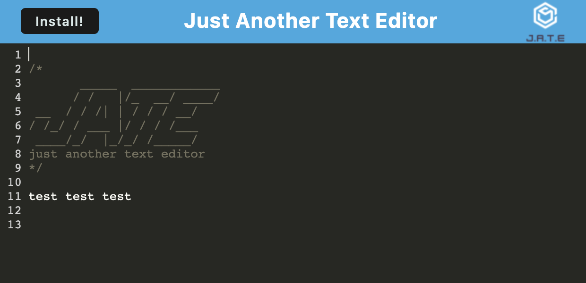

## 19 Progressive Web Applications (PWA) : Text Editor

This is a text editor application that can be installed and used offline. This allows the user to save snippets when not connected to the internet. 

https://dodt-text-editor.herokuapp.com/

## Table of Contents

* [Installation](#installation)
* [Usage](#usage)
* [Links](#links)
* [License](#license)

## Installation
This application requires the installation of Node.js and multiple npm packages including Babel and Express. Run **npm install** to install all modules. 

## Usage
To use the application, follow the link to the deployed site on Heroku and click Install. This will allow the user to access data offline. 

AS A developer

I WANT to create notes or code snippets with or without an internet connection

SO THAT I can reliably retrieve them for later use

## Links
Deployed Application: https://dodt-text-editor.herokuapp.com/
Github: https://github.com/adodt/text-editor

## License
MIT